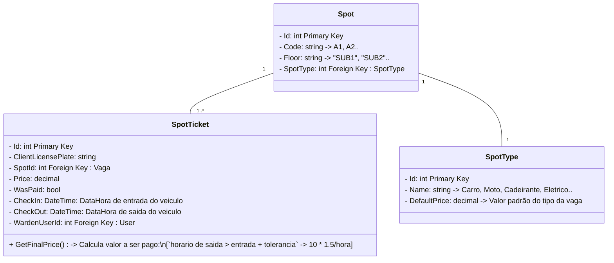

# 🐳 Dockerized Yii API + React SPA: Park Hub


Desenvolvimento de aplicação de **gerenciamento de estacionamento** utilizando o Framework definido por sorteio. 
**Programação III: CC 2022 Unoesc.**

## 🎲 Framework Definido
<p align="center">
    <a href="https://www.yiiframework.com/" target="_blank">
        
    </a>
</p>

[Yii2 Docs](https://www.yiiframework.com/doc/guide/2.0/en)

## 📚 Tech stack

<div align=center>
  
![Yii](https://img.shields.io/badge/yii-ebf1f2.svg?style=for-the-badge&logo=data:image/png%2bxml;base64,iVBORw0KGgoAAAANSUhEUgAAACAAAAAgCAMAAABEpIrGAAAABGdBTUEAALGPC/xhBQAAACBjSFJNAAB6JgAAgIQAAPoAAACA6AAAdTAAAOpgAAA6mAAAF3CculE8AAACslBMVEUAAADxiiqDyTOEyTOYvTHXmSzyiiyDyDQyrvFXu61As9hmv1ZQtbBAs9nxiirxiirxiirxiirxiirxiirxiirxiirxiirxiirxiirxiirxiirxiirxiirxiirxiirxiirxiiqDyTODyTODyTODyTODyTPxiirxiiqDyTODyTODyTODyTODyTODyTODyTODyTODyTODyTPxiirxiirxiirxiiqDyTODyTODyTODyTPxiirxiirxiirxiiqDyTODyTODyTODyTODyTPxiirxiirxiirxiiqDyTODyTODyTODyTODyTPxiirxiirxiirxiiqDyTODyTN7zjT2hyrxiirxiiqDyTODyTOAyzPyiSrxiirxiiqDyTODyTODyTOAxzXtiivxiirxiiqDyTOAwDmDtj3ziSrxiirxiiqDyTN8uj3rjCvxiirxiirxiiqDyTODyTN/uTyVsDnziSrxiiqDyTODyTN7uj30iSrxiirxiiqDyTODyTN9uj3ikC3xiirxiirxiiqDyTODyTODyTODyTODyTODyTODyTODyTN+uTyxpDXyiirxiirxiiqDyTODyTODyTODyTOEyTF8x0Rxu19/uTySsTrziSrxiio+stxCs9J/uTuLtDv0iSrxiipAs9hAs9h6uUiJtTj7hinxiipAs9hAs9hZtZt6uUpAs9hAs9hDs9FTtahAs9hAs9hAs9hAs9lAs9hAs9hAs9hAs9hAs9hAs9hAs9hAs9hAs9hAs9hAs9hAs9hAs9hAs9hAs9hAs9hAs9hAs9hAs9hAs9hAs9hAs9hAs9hAs9hAs9hAs9hAs9hAs9hAs9jxiiqDyTODyDSAvDqCxTV/ujyBwTd/uTyAvTqDyTKDxDR/uTt8uUSAuTpRta5rt259uUBAs9g/s9pCs9JatpdAs9n///+bs/oNAAAAz3RSTlMAAAAAAAAAAAAAAAAAACq+nxcow/2pGLkMAoX5aDLm0hwBBQgGAoJjK2eXs724o3xGFQa0pgMZz/ciCL3PEhzd/tgLAaHhIBHN+Z4aZv7kIwOqGyDbG3CpEITCCy3m/Xst45CW5zqV90sqmULwyRNT6+U4t3JX33Nv0B0x7LVC8fhhBzR2rdDk8fvfO9iiCgQSIzZQiPLyR8QkbPr6WKNMNuL9YDMED7P8VGL6+EUKueksI+PCDTPvdDTwzx0o6O1RFtTsZgIGsvvHS4TTdRseJWuXAAAAAWJLR0TlWGULvwAAAAd0SU1FB+UFDQsVOKM1xlcAAAHZSURBVDjLY2DAAhgZ+fgFBBkZGXAARkYh4fMiomI4VTAKip8HAgEJHAoYJaVA8uelZXAYwSgrB1ZwXl4BpoBJUUlZRZWJGeoCNYj8eRF1sBFMqhqaWto6unr6BoaKTEAFRsZQBedNTMEKzMwvQICFub4lExOjlTVMgY0tWIGd/QUYcHDUdGJxdoEpcHUDK3D3uIAAnl7erD6+UAV+/mAFAYEXkIF2UHAIVEFIKFgBUxiKggvhEZFQBVHRYH8yxcSiKIiLT0iEKEiChBRTQDKqESmpaWD59AxGNrACpkxHZPmLl7Kyc0AKcvOgIcnElF+ApODylcKiYqC8bwk8LphUS8sQCq5eu1ZeAVRQWYWIKyamar0amA3Xr12rras/39CIHJnsTE3NLa1t7R2dN27eunatq7vnfG8fWmQzMfVPmDhp8pSpt+9cmzZ9hvxMrKmBg3PW7Lv37s+ZO28+VnkurgULHzx89HjR4iVLsaYmrmXLHzx48OTJipXc2OW5Vq1+AFKxZi0P1tTItW79AzDYsJEXu4JNmyEKtmzlwq5g23aIgh1cOBTs3AWW370HuzwD1959IPn9B7hwKTh4CCh/+MhRHPIMXMeOPzhx8hROeWA4nD5z9hyq+QAq/D4JY4faeAAAACV0RVh0ZGF0ZTpjcmVhdGUAMjAyMS0wNS0xM1QxMToyMTo1NiswMDowMFdXIWsAAAAldEVYdGRhdGU6bW9kaWZ5ADIwMjEtMDUtMTNUMTE6MjE6NTYrMDA6MDAmCpnXAAAAV3pUWHRSYXcgcHJvZmlsZSB0eXBlIGlwdGMAAHic4/IMCHFWKCjKT8vMSeVSAAMjCy5jCxMjE0uTFAMTIESANMNkAyOzVCDL2NTIxMzEHMQHy4BIoEouAOoXEXTyQjWVAAAAAElFTkSuQmCC&logoColor=white)


</div>

<details>
<summary>

# 🤖 Overview
</summary>
<br>

# O que é Yii
Yii é um framework PHP de alto desempenho, baseado em componentes, para o rápido desenvolvimento de aplicações Web modernas. O nome Yii (pronunciado "Yi" ou [ji:]) significa "simples e evolutivo" em chinês. Também pode ser visto como um acrônimo para "Yes It Is!" (Sim, é isso!).

## Para que o Yii é melhor?
Yii é um framework genérico de programação Web, o que significa que pode ser usado para desenvolver todos os tipos de aplicações Web usando PHP. Devido à sua arquitetura baseada em componentes e suporte sofisticado de cache, ele é especialmente adequado para desenvolver aplicações em larga escala, como portais, fóruns, sistemas de gerenciamento de conteúdo (CMS), projetos de e-commerce, serviços Web RESTful, e assim por diante.

## Como o Yii se compara a outros frameworks?
Se você já está familiarizado com outro framework, pode achar útil saber como o Yii se compara:

Como a maioria dos frameworks PHP, o Yii implementa o padrão arquitetural MVC (Model-View-Controller) e promove a organização do código com base nesse padrão.
O Yii adota a filosofia de que o código deve ser escrito de forma simples, mas elegante. O Yii nunca tenta superprojetar as coisas apenas com o propósito de seguir estritamente algum padrão de design.
O Yii é um framework completo, fornecendo muitos recursos comprovados e prontos para uso: construtores de consultas e ActiveRecord para bancos de dados relacionais e NoSQL; suporte ao desenvolvimento de APIs RESTful; suporte a cache em vários níveis; e muito mais.
O Yii é extremamente extensível. Você pode personalizar ou substituir quase todas as partes do código central. Também pode tirar proveito da sólida arquitetura de extensões do Yii para usar ou desenvolver extensões redistribuíveis.
Alto desempenho é sempre um objetivo principal do Yii.
O Yii não é um show de um homem só; é apoiado por uma forte equipe de desenvolvedores principais, bem como por uma grande comunidade de profissionais que constantemente contribuem para o desenvolvimento do Yii. A equipe de desenvolvedores do Yii mantém um olhar atento às últimas tendências de desenvolvimento Web e às melhores práticas e recursos encontrados em outros frameworks e projetos. As práticas e recursos mais relevantes encontrados em outros lugares são regularmente incorporados ao núcleo do framework e expostos através de interfaces simples e elegantes.

[What is Yii?](https://www.yiiframework.com/doc/guide/2.0/en/intro-yii)

# Estrutura

|Arquivo/Diretório|Definição|
|-|-|
|.devcontainer/ |Diretório de configurações Docker + Devcontainer|
|.devcontainer/nginx/ |Servidor Proxy para conexão de back e front end em localhost ([NGINX](https://nginx.org/))|
|.devcontainer/www/ |Configuração para container de desenvolvimento PHP + NodeJS (base Alpine)|
|.devcontainer/docker-compose.yml|Configuração central dos containers (Banco de dados, PhpMyAdmin, NGINX, Aplicativos Web)|
|.devcontainer/devcontainer.json |Arquivo de configuração Dev Container. A porta de entrada das demais configurações para desenvolvimento.|
|backend/ |API REST em PHP (Yii2)|
|frontend/ |SPA Vite utilizando React (Typescript)|

## Visão geral

⚠️ ATENÇÃO: O projeto inicialmente não será publicado, portanto somente configurações de desenvolvimento estão presentes, o que pode não funcionar da maneira desejada em produção. ⚠️

O projeto foi visto como uma oportunidade de aplicar praticas modernas de programação, o combo

$$
\begin{array}
    \space SPA\space\textrm{(Single Page Aplication)} & \\
    + & \\
    API\space\textrm{(Application Programming Interface)} \\
    REST\space\textrm{(Representational State Transfer)}
\end{array}
$$

ou seja, websites totalmente divididos e especializados em suas responsabilidades. Aplicativos de "única página" fazem requisições de transferência de estado representacional (*REST*) através de interfaces de programação de aplicativos (*APIs*), isso permite uma grande separação e uma aproximação maior dos princípios *SOLID*, de que cada componente do sistema é focado em uma única responsabilidade, promovendo a independência e a modularidade.

## Nomenclatura sugerida *git*

### Branches
Sigla|Significado
-|-
Feat|*Feature*, ou seja, funcionalidade ou recurso novo
Fix|Correção de algum bug, erro de gramatica, formatação
WIP|*Work in Progress*, ou seja, trabalho em andamento em algo não bem definido, que pode ou não ser uma *feature*

```bash
$ git checkout -b feat/jwt-implementation

$ git checkout -b fix/customer-form-bugfix

$ git checkout -b wip/new-nginx-config

# Obs.: Fazer push da branch para remote pela primeira vez
$ git push --set-upstream origin branch-name
```

### Commits:
```bash
$ git commit -m "feat: Added Unit tests"

$ git commit -m "feat: Organized project structure"

$ git commit -m "fix: Fixed bug where customer form was sending 404"
```

</details>

<details>
<summary>

# 🏗️ Instalação requisitos técnicos
</summary>
<br>

# 🪟 Instalação para Windows

Irei detalhar o ambiente de desenvolvimento em [Dev Containers](https://containers.dev/) utilizando docker para um ambiente totalmente isolado e reproduzível.

Refira-se ao [overview](#overview) do projeto para mais detalhes sobre.

Caso prefira se encorajar a instalar o PHP, Composer, MySQL, Node e NPM, ou mesmo XAMPP na própria máquina, fique a vontade! *Boa sorte!*

> Obs.: O guia a seguir é para executar a instação do [WSL](https://aka.ms/wsl), que recomendo altamente para desenvolvedores em Windows.

## 🐧 Instalar [WSL](https://aka.ms/wsl): Debian

Powershell (Admin):
```console
PS> wsl --install -d debian
```
Após instalado, execute as etapas de instalação e configure seu usuário linux. Então, em sua nova máquina Debian, continue:
> Obs.: Recomendo que utilize um aplicativo de terminal. Ex.: [Windows Terminal](https://apps.microsoft.com/detail/9n0dx20hk701?rtc=1&hl=en-us&gl=US)

## 🐳 Instalar [Docker Engine](https://docs.docker.com/engine/install/)
1. Caso seja **sua primeira vez** instalando o docker, é possível executar o script auxiliar **oficial** para facilitar a instalação:
```console
$ curl https://get.docker.com/ | sh
```
2. Após instalado, talvez seja necessário permitir que o Docker possa executar seus serviços, tradicionalmente através do *systemd*. 
  * [O que é o systemd?](https://learn.microsoft.com/pt-br/windows/wsl/systemd#what-is-systemd-in-linux)
  * [Habilitar systemd](https://learn.microsoft.com/pt-br/windows/wsl/systemd#how-to-enable-systemd)
3. O Docker inicialmente precisa de privilégio de *super usuário*, nesse sentido, siga as instruções da [habilitar acesso ao seu usuario](https://askubuntu.com/a/477554).

```console
$ sudo groupadd docker
$ sudo gpasswd -a $USER docker
$ docker run hello-world # Se esse comando funcionar corretamente sem 'sudo', parabéns! Está tudo devidamente configurado. 
```

## ⚙️ Configuração [VS Code](https://code.visualstudio.com/)

### Extensões
* [VS Code: Docker](https://marketplace.visualstudio.com/items?itemName=ms-azuretools.vscode-docker)
* [VS Code: Remote Dev Pack](https://marketplace.visualstudio.com/items?itemName=ms-vscode-remote.vscode-remote-extensionpack)

</details>

<details>
<summary>

# 🏃‍♂️ Executar o Ambiente de Desenvolvimento
</summary>
<br>

## 1. Setup do projeto
### 🚀 Codespaces
[Faça um fork](https://docs.github.com/en/pull-requests/collaborating-with-pull-requests/working-with-forks/fork-a-repo) do repositorio e então [abra uma instancia "codespace"](https://docs.github.com/en/codespaces/developing-in-a-codespace/creating-a-codespace-for-a-repository)

É possível também [abrir um *codespace* localmente](https://docs.github.com/en/codespaces/developing-in-a-codespace/using-github-codespaces-in-visual-studio-code), fazendo um tunel de sua maquina até a instancia remota do GitHub.

### 🐉 VS Code (Certifique-se que os passos de instalação e extensões estão corretos)
Clone o repositório do github
```bash
git clone https://github.com/joaozenaro/park-hub.git
```
Abra o diretório clonado com o vscode
```bash
code park-hub/
```
Abra o container

$Ctrl + Shift + P \longrightarrow \textrm{Dev Containers: Rebuild and Reopen in Container}$

[Docs](https://code.visualstudio.com/remote/advancedcontainers/develop-remote-host#_connect-using-the-remote-ssh-extension)
## 2. Execução do projeto
Executar os comandos dentro do bash WSL. Tanto nos codespaces como localmente.
### Backend
Instalar pacotes
```sh
$ cd backend/
$ composer install
```
Criar a primeira migração no banco, caso não exista
```bash
$ ./yii migrate/up --migrationPath=@yii/rbac/migrations # Work in progress
$ ./yii migrate
```
Executar o servidor
```bash
$ ./yii serve 0.0.0.0
```
### Frontend
Instalar pacotes
```sh
$ cd frontend/
$ npm i
```
Executar o servidor
```bash
$ npm run dev
```

</details>

<details>
<summary>

# 🚩 Regra de Negócio
</summary>
<br>

## Diagrama de classes

## Requisitos gerais
- [x] Níveis de acesso (Admin / User)
    - Cadastro feito por outro admin:
        - Admin: Edição todos perfis
        - User: Edição próprio perfil

- [x] Login
    1. Admin primeiro cria um usuario basico
    1. Usuario recebe email de convite
    1. Usuario entra na aplicação e completa seu cadastro

- [ ] Planos (pré-pago / pós-pago)
    - A ser definido

- [ ] Vagas
    - Cadastro de novas vagas
    - Utilização de vagas (permanência para cobrança)
    - Consulta de vagas disponíveis no momento
     
- [ ] Fluxo de veículos (entrada / saída)
    - Listagem filtrada para saber:
        - Número de vagas utilizadas por tempo (1 hr, 1 dia, 1 semana, mes...)
        - Utilizadas no momento (Tem data de entrada, mas sem saída)

- [ ] Relatórios sobre movimentação financeira
    - Igual o fluxo de veículo, mas com os valores pagos

[Figma](https://www.figma.com/design/0dlX5PUwTy1rC8o75kMUlf/UNOESC?node-id=11-3&t=kFh40tNdcUobpXaS-0)

</details>

<details>
<summary>

# ⚒️ Documentação (WIP)
</summary>
<br>

## Helper script
Execute o comando abaixo dentro do ambiente de desenvolvimento para agilizar os processos. 
```console
$ run [options]
```

## Endpoints

Serviço|Endpoint
-|-
Frontend|`localhost/`
API|`localhost/api/`
MySQL|`localhost:3306`
PhpMyAdmin|`localhost:9010`
Mailhog|`localhost:8025`

</details>
